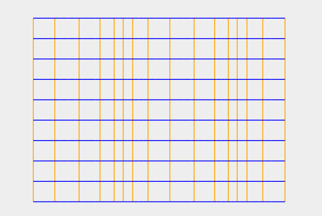
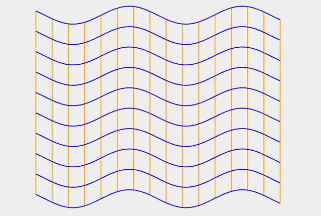
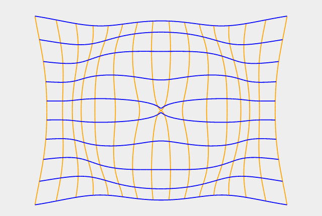
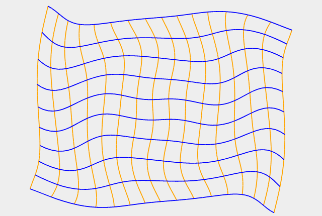
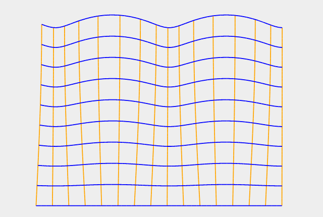

## Wave Models

A simulation of several elastic body waves written in JavaScript using SVG control.

### P-wave

A P-wave is one of the two main types of elastic body waves, called seismic waves in seismology. P-waves travel faster than other seismic waves and hence are the first signal from an earthquake to arrive at any affected location or at a seismograph. P-waves may be transmitted through gases, liquids, or solids. 

The equation of simple P-wave is given by:

### S-wave

In seismology, S-waves, secondary waves, or shear waves (sometimes called an elastic S-wave) are a type of elastic wave, and are one of the two main types of elastic body waves, so named because they move through the body of an object, unlike surface waves.

The S-wave is a transverse wave, meaning that, in the simplest situation, the oscillations of the particles of the medium is perpendicular to the direction of wave propagation, and the main restoring force comes from shear stress.

The equation of simple S-wave is given by:

### Radial P-wave

The equation of a radial P-wave is given by:

where *&theta;*, *r* are the polar coordinates of a point *(x0, y0)* with respect to the wave origin point *C(xc, yc)*.

### Radial S-wave

The equation of a radial S-wave is given by:

where *&theta;*, *r* are the polar coordinates of a point *(x0, y0)* with respect to the wave origin point *C(xc, yc)*.

### Rayleigh wave

[Rayleigh waves](https://en.wikipedia.org/wiki/Rayleigh_wave) are a type of surface
acoustic wave that travel along the surface of solids.

The equation of a Rayleigh wave is given by:

where *&phi;* is wave phase in a point,
*d* is depth of a point *(x0, y0)* with respect to medium top level *Y*,
*h* is total medium depth,
*Ax* and *Ay* are horizontal and vertical
amplitudes of the Rayleigh wave respectively.
