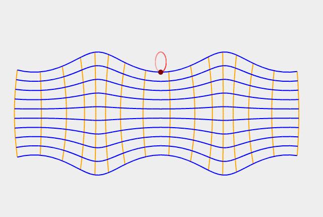
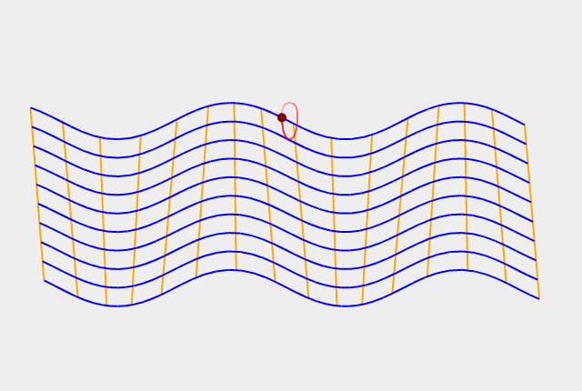

## Wave Models

A simulation of several elastic body waves written in JavaScript using SVG control.

### P-wave

A P-wave is one of the two main types of elastic body waves, called seismic waves in seismology. P-waves travel faster than other seismic waves and hence are the first signal from an earthquake to arrive at any affected location or at a seismograph. P-waves may be transmitted through gases, liquids, or solids. 

### S-wave

In seismology, S-waves, secondary waves, or shear waves (sometimes called an elastic S-wave) are a type of elastic wave, and are one of the two main types of elastic body waves, so named because they move through the body of an object, unlike surface waves.

The S-wave is a transverse wave, meaning that, in the simplest situation, the oscillations of the particles of the medium is perpendicular to the direction of wave propagation, and the main restoring force comes from shear stress.

### Radial P-wave

When disturbed by a radial P-wave particles oscillate along the radial axis *r*.

### Radial S-wave

When disturbed by a radial S-wave particles perform circular motion around the wave origin point.

### Rayleigh wave

[Rayleigh waves](https://en.wikipedia.org/wiki/Rayleigh_wave) are a type of surface
acoustic wave that travel along the surface of solids.
There are two components in a motion of a particle disturbed by a Rayleigh wave:
horizontal and vertical that totals in movement along an ellipse.

### Lamb waves

[Lamb waves](https://en.wikipedia.org/wiki/Lamb_waves)
propagate in solid plates. They are a combination of standing waves and
elastic propagational waves that, like Rayleigh waves, are constrained by
the elastic properties of the surface(s) that guide them.

There are two modes of Lamb waves implemented in the demo: symmetric (*S0-mode*)
and antisymmetric (*A0-mode*) waves.

Their properties turned out to be quite complex. Since the 1990s,
the understanding and utilization of Lamb waves has advanced greatly, thanks
to the rapid increase in the availability of computing power. Lamb's theoretical
formulations have found substantial practical application, especially in the field
of nondestructive testing.
